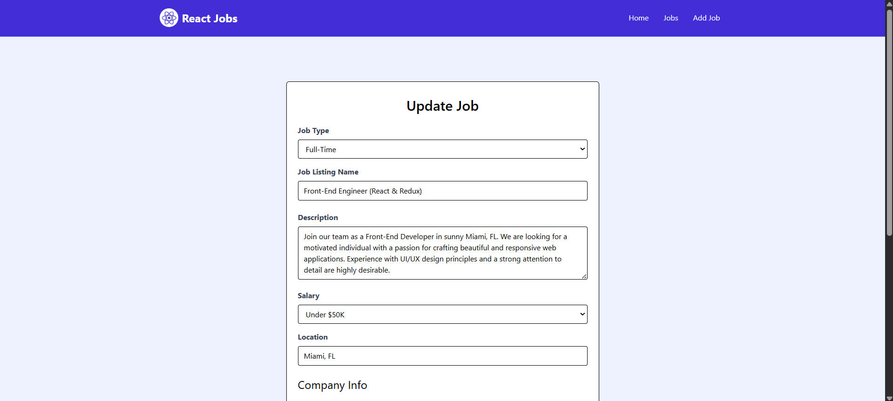

# React Jobs

A React-based job board application for browsing, adding, editing, and deleting job listings. Built with React, React Router, Tailwind CSS, and JSON Server for a mock backend API.

## Table of Contents
- [Features](#features)
- [Technologies Used](#technologies-used)
- [Installation](#installation)
- [Usage](#usage)
- [Screenshots](#screenshots)
- [Project Structure](#project-structure)
- [Contributing](#contributing)
- [License](#license)

## Features
- Browse recent job listings on the homepage.
- View all job listings with detailed information.
- Add new job listings with details like title, type, salary, location, and company information.
- Edit existing job listings.
- Delete job listings with confirmation.
- Responsive design with Tailwind CSS.
- Loading states with a spinner for asynchronous data fetching.
- Toast notifications for successful actions (e.g., adding or deleting jobs).
- 404 page for invalid routes.

## Technologies Used
- **React**: Frontend library for building user interfaces.
- **React Router**: For client-side routing.
- **Tailwind CSS**: Utility-first CSS framework for styling.
- **JSON Server**: Mock backend API for job data.
- **React Icons**: Icon library for UI elements.
- **React Spinners**: Loading spinner for async operations.
- **React Toastify**: Toast notifications for user feedback.
- **Vite**: Build tool and development server.

## Installation
1. Clone the repository:
   ```bash
   git clone https://github.com/your-username/react-jobs.git
   ```
2. Navigate to the project directory:
   ```bash
   cd react-jobs
   ```
3. Install dependencies:
   ```bash
   npm install
   ```
4. Start the JSON Server (mock backend):
   ```bash
   npm run server
   ```
   This runs the JSON Server on `http://localhost:3001`.
5. Start the Vite development server:
   ```bash
   npm run dev
   ```
   The app will be available at `http://localhost:3000`.

## Usage
- **Homepage**: Displays a hero section, cards for developers and employers, recent job listings, and a "View All Jobs" link.
- **Jobs Page**: Lists all available job listings with details like title, type, salary, and location.
- **Job Details Page**: Shows detailed information about a specific job, including company details and options to edit or delete the job.
- **Add Job Page**: Form to add a new job listing with fields for job type, title, description, salary, location, and company information.
- **Edit Job Page**: Form to update an existing job listing, pre-filled with current job data.
- **404 Page**: Displayed for invalid routes with a link to return to the homepage.

## Screenshots
Below are placeholders for screenshots of the key pages in the application. Replace these with actual image URLs after capturing and uploading screenshots to your repository or an image hosting service.

### Homepage


### Jobs Page


### Job Details Page


### Add Job Page


### Edit Job Page


### 404 Not Found Page


## Project Structure
```
react-jobs/
├── src/
│   ├── assets/
│   │   └── images/
│   │       └── logo.png           # Logo image for the navbar
│   ├── components/
│   │   ├── Card.jsx               # Reusable card component
│   │   ├── Hero.jsx               # Hero section for the homepage
│   │   ├── HomeCards.jsx          # Cards for developers and employers
│   │   ├── JobListing.jsx         # Individual job listing component
│   │   ├── JobListings.jsx        # List of job listings
│   │   ├── NavBar.jsx             # Navigation bar
│   │   ├── Spinner.jsx            # Loading spinner
│   │   └── ViewAllJobs.jsx        # View all jobs button
│   ├── layouts/
│   │   └── MainLayout.jsx         # Main layout with navbar and outlet
│   ├── pages/
│   │   ├── AddJobPage.jsx         # Page for adding a new job
│   │   ├── EditJobPage.jsx        # Page for editing a job
│   │   ├── HomePage.jsx           # Homepage with hero, cards, and recent jobs
│   │   ├── JobPage.jsx            # Job details page
│   │   ├── JobsPage.jsx           # All jobs listing page
│   │   └── NotFoundPage.jsx       # 404 page
│   ├── App.jsx                    # Main app with routes
│   ├── index.css                  # Global CSS
│   ├── main.jsx                   # Entry point
│   └── jobs.json                  # Mock data for JSON Server
├── package.json                   # Project dependencies and scripts
├── vite.config.js                 # Vite configuration
└── README.md                      # This file
```

## Contributing
Contributions are welcome! Please follow these steps:
1. Fork the repository.
2. Create a new branch (`git checkout -b feature/your-feature`).
3. Make your changes and commit (`git commit -m 'Add your feature'`).
4. Push to the branch (`git push origin feature/your-feature`).
5. Open a pull request.

